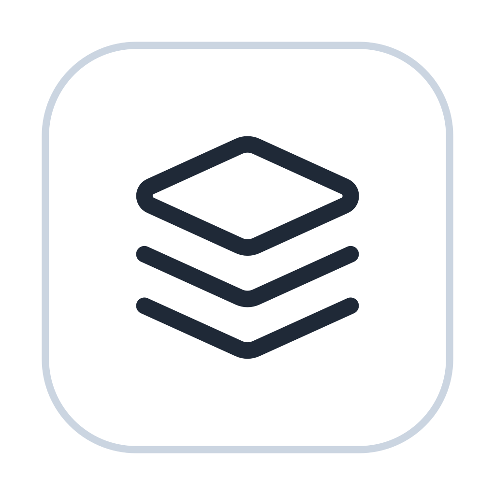

  

<h1 align="center">SoloStack</h1>

  <strong>macOS 上的大数据组件本地管理器</strong> 
  在本机安装、配置、启停、卸载 Hadoop 与 Kafka，全程图形界面

  v0.1.0 · 仅支持 Apple Silicon

## 支持的组件

| 组件 | 版本 |
|---|---|
| Hadoop | 3.5.0（单机伪分布式） |
| Kafka | 4.3.1（KRaft） |
